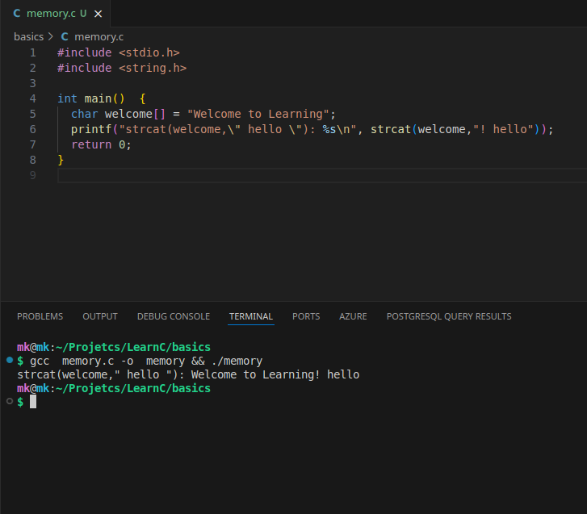
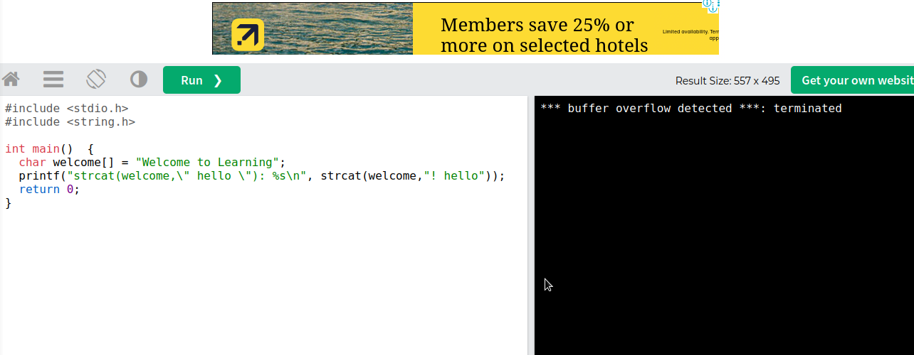

# 💡 Understanding Memory Management & Garbage Collection Across Languages

A sample code in c 

```c
#include <stdio.h>
#include <string.h>

int main()  {
  char welcome[] = "Welcome to Learning";
  printf("strcat(welcome,\" hello \"): %s\n", strcat(welcome,"! hello"));  
  return 0;
}

```

### Does this C code work fine ? What do you think?
This code may “work” on some machines but fail on others because welcome is sized exactly for the original string. Appending with strcat writes beyond allocated memory, causing undefined behavior.

here is output

## on my machine


## on w3school



### let's check on garbage collection in general


###### 🔹 Stack vs Heap

* **Stack:** Stores local variables and function calls; automatically freed when the function ends, No garbage collection needed.

* **Heap**: Stores dynamically allocated objects; requires explicit freeing or garbage collection.

##### 🔹 Memory Management & Garbage Collection Across Languages


| Language | Memory Management / GC | Stack Variables Example | Heap Variables Example |
|---|---|---|---|
| C | Manual; `malloc/free`; no GC | `int a = 5;` | `int* p = malloc(sizeof(int));` |
| C++ | Manual + RAII; destructors free memory; smart pointers optional | `int a = 5; std::string s;` | `int* p = new int(5); std::string* s = new std::string("Hi");` |
| Rust | Ownership + borrowing; no GC; memory freed when out of scope | `let x = 5; let s = "Hi";` | `let v = Box::new(10);` |
| Go | Garbage collected; stack grows/shrinks automatically | `var x int = 5` | `p := new(int); s := make([]int, 10)` |
| Java | Garbage collected (JVM); objects on heap, primitives on stack | `int x = 5;` | `String s = new String("Hello");` |
| C# | Garbage collected (CLR); stack for value types | `int x = 5; struct Point p;` | `var s = new String("Hello");` |
| Python | Garbage collected; everything is heap-allocated; stack for references | `x = 5` (reference on stack for frame) | `y = [1,2,3]; s = "hello"` |
| JavaScript | Garbage collected; everything on heap, stack for references | `let x = 5;` | `let arr = [1,2,3]; let obj = {a:1};` |


### Concluding

* C requires manual memory management, prone to overflow or leaks.
* Modern languages like Java, Python, Go, C#, and JS rely on garbage collection, removing unused heap objects automatically.
* Rust avoids GC but guarantees memory safety via ownership and scope rules.